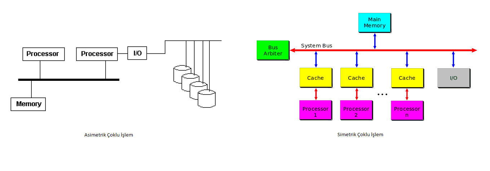

GİRİŞ 
Çok işlemcili mimarileri anlatacağım bu yazı da öncelikle çok işlemcili bir mimarilerin nasıl çalıştığını anlamak adına bu mimarilerde çoklu işlemin nasıl yapıldığı ve bilgisayarda çok işlemcili çalışma prensibi nedir kısaca bu konuya değineceğim. Ardından çok işlemci yapısına sahip bilgisayar mimarilerinin çeşitlerini ve sınıflandırmalarını yapacağım. Bu sınıflandırmayı yaparken cache, process management ve multi core başlıkları ekseninde değerlendirmelerimi yapacağım. 
Çok İşlemcili Mimariler 
Bilgisayar sistemlerindeki performansın iyileştirmek bazı durumlarda erişilebilirlik özelliğini arttırmak amacıyla çok sayışa işlevsel birimin (ALU,PC,Memory,Floating-Point,vb.) paralel olarak çalıştırılır. Temelinde tam da bu mantık olan çok işlemcili mimarilerde aynı bilgisayar sistemi içerisinde 2 ya da daha fazla CPU kullanılarak performansı ve erişilebilirliği arttırmak amaçlanır. Bir sistemin birden fazla işlemciyi destekleyebileceğini veya aralarında görev tahsis edebilme yeteneği de bu durumla alakalıdır. Performans artışı işlem havuzundaki işlemlerin farklı işlem ünitelerine dağıtılmasıyla gerçekleştirilir. Kısaca özetleyecek olursak çok işlemcili mimariye sahip bilgisayar sistemleri aynı ana bellek ve çevre birimlerini paylaşabilen iki veya daha fazla işlem birimi bulunduran bu CPU’lar için farklı cache belleklerin kullanılabildiği bilgisayar sistemleridir ve birden fazla işlemci aynı işin farklı kısımlarını gerçekleştirebilir. Çoklu işlemcili mimariler çoklu işlem mantığı üzerinden çalışır ve çoklu işlem simetrik ve asimetrik olarak iki başlıkta incelenir. 
• Simetrik çoklu işlem (SMP), iki veya daha fazla özdeş işlemcinin tek bir paylaşılan ana belleğe bağlandığı, tüm giriş ve çıkış aygıtlarına tam erişime sahip olduğu ve işleyen tek bir işletim sistemi örneği tarafından denetlendiği çok işlemci yapısıdır. Çok işlemcili bir bilgisayar donanımı ve yazılım mimarisi açısından tüm işlemcileri eşit, özel amaçlı olarak hiçbir şey ayırmadan kullanır.  
• Asimetrik çoklu işlem (AMP) , tüm CPU'lar eşit muamele görmez. Örneğin ilk CPU; donanım veya işletim sistemi düzeyinde bir sistem CPU’nun sistem kodunu çalıştırmasına ya da CPU’nun I/O işlemlerini gerçekleştirmesine izin verebilir, ikinci herhangi bir CPU'nun hem işletim sistemi kodunu çalıştırmasına hemde I / O işlemlerini gerçekleştirmesine izin verir. Böylece işlemci rolleri açısından simetrik olur, ancak bazı veya tüm çevre birimlerini belli CPU'lara bağlar; böylece çevre birimlere göre asimetrik olurlar. 
Yukarıdaki tabloda 3 GB ‘lık bir database üzerinde yapılan bir deneyde multi processor ve dual-processor sistemlerde elde edilen transaction yani işlem miktarlarını görmekteyiz. Üst düzey süreç işlemlerinde iş yükünü ölçeklendirmek için çok büyük önem arz eden çoklu işlem mimarileri büyük verileri ve süreçleri yönetebilme kabilitine sahiptir. Çoklu işleme, iki veya daha fazla işlemcinin bir araya getirilerek, işlenmesi gereken buyruğun daha hızlı bir şekilde işlenmesini sağlamaya yönelik bir tasarımdır.  
 

<h3>Çok İşlemcili Mimarilerin Sınıflandırılması<h3> 
Şemamızda görüldüğü üzere mikro işlemciler farklı başlıklarda komut ve veri yönetimlerine göre ayrılmaktadırlar. Biz çok işlemcili mimari yapıya sahip olan ve temelde iki başlıkta sınıflandırılmış olan MIMD başlığı altıdaki Tightly Coupled ve Loosely Coupled başlıklarını inceleyeceğiz. 
<h4>1-)Tightly Coupled Multiprocessor</h4> 
TCM işlemci mimarilerindeki sistem aynı bus seviyesinde bağlı çoklu CPU elemanları içermektedir. Bu CPU elemanları merkezi paylaşılan bellek elemanlarına erişebilir yada yerel ve lokal olmak üzere iki tip bellek hiyerarşilerine katılabilirler.TMP işlemci mimarisinin genel özellikleri şu şekildedir.  
• Tek bir fiziksel adres uzayı vardır yani aynı bellek paylaşılır. 
• İşlemciler, ortak bellekteki paylaşılan değişkenler üzerinden iletişim kurarlar. 
• Tüm işlemciler, ortak belleğin tüm alanlarına, komutlar ile erişebilirler. 
• Sistem, tümleşik ortak bir işletim sistemi tarafından kontrol edilir ve işletim sistemi, işlemciler arasındaki etkileşimi, süreç , görev, dosya işlemlerinin yapılmasını sağlar. 
• Paylaşılan değişkenler nedeniyle işletim sistemi, işlemciler arasında senkronizasyonu da desteklemelidir. 
Bu kategoride inceleyeceğimiz 2 alt başlık olacaktır. 
• SMP & UMA 
• NUMA SMP & UMA (Symetric Multiprocessor & Uniform Memory Acces) Çok İşlemciler 
Bellek erişim süresi, hangi adrese erişilirse erişilsin, tüm işlemciler için neredeyse aynıdır. SMP yani simetrik çoklu işleme daha önce değinmiştik. Bu kısımda simetrik çoklu işlem yapan bir işlemci için değerlendirmelerimizi yapacağız. Bu iki sistem hakkındaki değerlendirmelerim şu şekilde; 
• Ortak bir adres uzayını ve tek bir işletim sistemini paylaşırlar. 
• Sistemdeki tüm işlemciler aynı işlevleri yerine getirme yeteneğine sahiptirler. 
• Bütün elemanlar ortak bir güzergah ile birbirlerine bağlıdırlar. 
• İki veya daha fazla sayıda aynı özelliklere sahip işlemci içerirler. 
• Bellek erişim süresi, tüm işlemciler için, yaklaşık olarak aynıdır. 
• İşlemciler ortak bellek yani main memory ve I/O birimlerini paylaşırlar. 
• Erişilebilirlik sağlar yani tüm işlemciler, aynı işlevleri gerçekleştirebilecek yetenekte olduklarından, bir işlemcinin devre dışı kalması, sistemin durmasına neden olmaz. 
• Sistemimize yeni bir işlemci ekleyip performansını artırabilmemiz mümkündür. 
• İşlemci sayısı arttıkça, ortak yolu kullanan işlemler çatışabilir ve performansın düşme ihtimali oluşur. 
Yukarı şekilde gördüğümüz üzere açıklamakta olduğumuz sistemde her işlemci, kendine ait ALU, kontrol birimi, saklayıcılar ve bir veya daha fazla düzeyli cache bellek içermektedirler. Ana bellek, interleaved veya multiport olabilir.Böylece farklı bloklara, aynı anda erişmek mümkün olur. Ara bağlantı sistemi, ortak yol veya crossbar switch olarak tasarlanabilir.   
Sistemimizde avantajlı ve dezavantajlı durumlar mevcuttur. Basitlik, Esneklik ve Güvenilirlik sistemimizin bize sağladığı avantajlar arasındadır. Bu başlığımızda işlemcilerin bellek adresleme modülleri, arayüzleri , zaman paylaşım yöntemleri ve yol paylaşımları tek işlemcili sistemlerdeki gibidir. İşlem sürecine yenilerinin eklenebilmesi oldukça kolaydır fakat kısıtları mevcuttur. Paylaşılan bir yol kullanılıyor olması herhangi bir sürecin sorun ile karşılaşması durumunda tüm sistemin işlemine alı koyulmasını engeller. Performans konusunda dezavantajlı durumlar mevcuttur. Belleğe erişimlerin tamamı ortak yol ile olduğu için ortak olarak tüm sisteme hizmet veren yol çevresi sistem hızını sınırlar. Ortak yol ile işlem yapıldığı esnada bir işlem yolu kullanırken diğer işlemler ana belleğe erişemezler. Bu sorunun çözümü sıkça işlem gören veriler, işlemcilerin yerel cache belleklerinde tutulurarak olur böylece ana belleğe sıkça erişim gereksinimi azaltılmış olur.   
<h4>NUMA (Nonuniform Memory Access) Çok İşlemciler</h4> 
Bir önceki sistemimizde incelediğimiz ve çözümünü sunduğumuz gibi SMP ‘de performans bizim için bir darboğazdır. Ayrıca işlemci sayısı sınırlıdır. Bu sistemimizin özelliklerini şöyle sıralayabiliriz: 
Özellikleri: 
• Tek Adres Alanı ile paylaşımlı bellek sunar ve tek işletim sistemi üzerindedir. 
• Paylaşılan bellek, fiziksel olarak, memory instruction bufferlara dağıtılır. Bu sistemlere, dağıtılmış
paylaşımlı bellek sistemleri de denir. 
• Bir MİB, kendi bellek modülüne, diğer modüllerden daha hızlı erişebilir.  
<h3>2-) Loosely Coupled </h3> 
İlk maddemizde değerlendirmiş olduğumuz sıkıca bağlanmış sistemler daha iyi performans göstermesine ve gevşek bağlı sistemlerden fiziksel olarak daha küçük olmasına rağmen. Gevşek bağlı bir sistemdeki düğümler genellikle ucuz eşya bilgisayarlarıdır ve sistemden ayrıldıklarında bağımsız makineler olarak geri dönüştürülebilir. Güç tüketimine bakıldığında tightly coupled sistemler, çok daha fazla enerji verimi sağlayabilirler. Ayrıca gevşek bağlı sistemler, farklı sistemlerde farklı işletim sistemleri veya işletim sistemi sürümleri çalıştırma yeteneğine sahiptirler. Bu sistemin genel özellikleri şu şekildedir:  
• Her işlemci, kendi fiziksel adres alanına sahiptir.  
• Standart ağ donanımları üzerinden birbirlerine bağlı bilgisayarın boyutu, on binlerce sunucuya ve daha fazlasına ulaştığında, depo ölçekli (warehouse-scale) bilgisayarlar (cloud computing) olarak adlandırılırlar.  
• Bu işlemciler, mesaj geçirme yoluyla haberleşir. 
Yararları:  
• Bir sistem her biri çok işlemcili olan onlarca, yüzlerce, hatta binlerce makine içerebilir ve sisteme küçük artışlarla, yeni elemanlar eklemek mümkündür bu sayede sistem daha ölçeklenebilir bir yapıda olur.  
• Bir kümedeki her düğüm, bağımsız bir sistemdir bu nedenle, bir süreçteki arıza tüm sistemin kaybı anlamına gelmez.  
• Ucuz, kolayca bulunabilen parçalar kullanarak, büyük hesaplama gücü yüksek bir sistem oluşturmak mümkündür. 
<h3>SONUÇ</h3>  
Çok işlemcili mimarileri hakkındaki araştırmamda tek işlemcili mimarilerin (işlemci mimarileri şeması resim olarak paylaşılmıştır) ne gibi sorunlara yol açtığı bu sorunlara karşı hangi methodların geliştirildiği yeni geliştirilen methodlardaki özellikler, avantajlar ,dezavantajlar , söz konusu dezavantajların giderilmesi ve performans gibi alt başlıkların detaylıca inceleyerek öğrendim. Çok işlemcili ve tek işlemcili mimarilerde process management , multi core ve cache konularını içeren olay ve sonuçlar hakkında detaylı bilgi edindim. Bilgisayarlı sistemlerde processlerin birden fazla işlemci içerisinde işlenmesi esnasında adres alanının paylaşılması, bellek paylaşımı, komutların bufferlara dağılımı, erişilebilirliğin örnekleri , sistemdeki performans artışları , işlemci sayısı arttıkça ortak yolu kullanan işlemlerin çatışması , iş yükünün ölçeklendirilmesi gibi ne aşamalardan geçerek ne gibi tepkiler ile karşılaşıldığı konusunda araştırmam sayesinde detaylıca bilgi edindim. 
<h4>KAYNAKLAR</h4> 
[1] https://en.0wikipedia.org/wiki/Multiprocessing  
[2] http://ninova.itu.edu.tr/en/courses/faculty-of-computer-and-informatics/22/blg-322/ekkaynaklar?g1044527  
[3] http://www.wikizero.org/index.php?q=aHR0cHM6Ly9lbi53aWtpcGVkaWEub3JnL3dpa2kvQXN5bW1ldHJpY19tdWx0aXByb2Nlc3Npbmc  
[4] http://www.wikizero.org/index.php?q=aHR0cHM6Ly9lbi53aWtpcGVkaWEub3JnL3dpa2kvU3ltbWV0cmljX211bHRpcHJvY2Vzc2luZw  
[5] http://www.wikizero.org/index.php?q=aHR0cHM6Ly9lbi53aWtpcGVkaWEub3JnL3dpa2kvTm9uLXVuaWZvcm1fbWVtb3J5X2FjY2Vzcw  
[6]http://www.eng.auburn.edu/~agrawvd/COURSE/E6200_06/STUDENT_TALKS/Multiprocessor_YChen.ppt  
[7] https://www.slideshare.net/arpanbaishya/multiprocessor-architecture  
[8] http://www.pearsonitcertification.com/articles/article.aspx?p=426771&seqNum=2  

